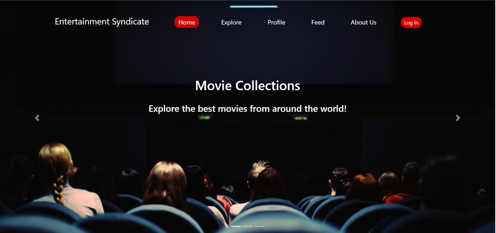

# Entertainment-Syndicate

## Projetc Description.
As the name indicates this website is about entertainment and fun, the main idea is to allow the users to search for their favorite Movies, Animes, and Games and add them to their favorite, and if the users want they can write a comment and share what they picked to others.

[Demo Video](https://www.youtube.com/watch?v=kLEzGiks3Fw)  
[Deployment ](https://entertainment-syndicate.netlify.app/)   
[Project Backtend](https://github.com/Entertainment-Syndicate/backend-entertainment-syndicate)

## Team Members
- Mahmoud Saadeh
- Abdelrahman Al Daour
- Dana Younes
- Yahia Qous
- Hiba Salem

## Main Features 
- Authentication and Authorization (auth0)
- Multiple filtering (based on type or categories or both)
- Add to favourite list and remove from it. 
- Add a public review in addition to edit and delete it. 

## Resources and Technologies
a Full-stack Web app that offers collections of the best movies, anime, and games, also a list of personal favourites. 
- Built with React components to communicate with a Node.js Express API server and MongoDB in addition to pure CSS and React-Bootstrap.

- Front end

  - React.Js
  - React Bootstrap 
  - Auth0 

- Backend

  - Node.js
  - MongoDB
  - Express
  - Auth0
  - APIs 
    - [api.jikan.moe](api.jikan.moe)
    - [api.themoviedb](api.themoviedb)
    - [freetogame.com](freetogame.com)

## Wireframes

| Home Page                                                                                                           | Explor Page                                   |
| :-------------                                                                                                      | :-------------------------------------- |
|  |  |

| Profile Page                                                                                                        | About us Page                                   |
| :-------------                                                                                                      | :-------------------------------------- |
|    |  |

## Domain Modeling

## Database Schema Diagram

